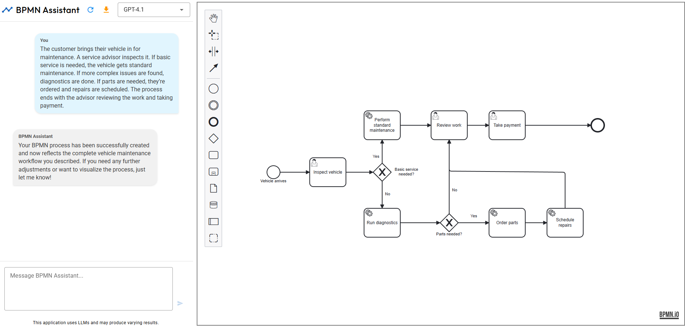

BPMN Assistant is an application that uses Large Language Models (LLMs) to assist with creating, editing, and
interpreting Business Process Model and Notation (BPMN) diagrams.

## Quickstart

1. Clone the repository

```
git clone https://github.com/jtlicardo/bpmn-assistant.git
```

```
cd bpmn-assistant
```

2. Set up your environment variables

<details>
<summary>Linux, macOS</summary>

```
cd src/bpmn_assistant
```

```
cp .env.example .env
```

</details>

<details>
<summary>Windows</summary>

```
cd src\bpmn_assistant
```

```
copy .env.example .env
```

</details>

3. Open the `.env` file and replace the placeholder values with your actual API keys.

4. Build and run the application

```
docker-compose up --build
```

Alternatively run the 3 components manually from a shell

- bpmn_assistant (backend, run from ./src/bpmn_assistant)
  `uv run uvicorn app:app --host 127.0.0.1 --port 8000`
- bpmn_layout service (run ./src/bpmn_layout_server)
  `npm install` followed by `node server.js` 
- bpmn_frontend (run ./src/bpmn_frontend)
  `npm install` followed by `npm run dev`

5. Open your browser and go to `http://localhost:8080`



## Prerequisites

- [Docker](https://docs.docker.com/get-docker/)
- [Docker Compose](https://docs.docker.com/compose/install/)
- At least one of the following API keys:
    - [OpenAI API key](https://platform.openai.com/docs/quickstart)
    - [Anthropic API key](https://console.anthropic.com/)
    - [Google AI Studio (Gemini) API key](https://aistudio.google.com/app/apikey)
    - [Fireworks AI API key](https://docs.fireworks.ai/getting-started/quickstart)
    - Alternatively run a model locally via [Ollama](https://ollama.com) or [llama-swappo](https://github.com/kooshi/llama-swappo)*

Note: You can use any combination of the API keys above, but at least one is required to use the app.

## Supported models

### OpenAI

* GPT-5
* GPT-5 mini
* GPT-4.1

### Anthropic

* Claude Sonnet 4
* Claude Opus 4

### Google

* Gemini 2.5 Flash
* Gemini 2.5 Pro

### Fireworks AI

* Llama 4 Maverick
* Qwen 3 235B
* Deepseek V3
* Deepseek R1

### Ollama or llama.cpp/llama-swappo

* Every GGUF encoded model

To run llama-swappo

* Clone [llama.cpp](https://github.com/ggml-org/llama.cpp) from its github repo, compile and install it. See [here](https://github.com/ggml-org/llama.cpp/blob/master/docs/build.md) for detailed description.
* Download your GGUF encoded model of your choice from hugging face, for example [granite-4-tiny](https://huggingface.co/ibm-granite/granite-4.0-tiny-preview-GGUF)
* Clone [llama-swappo](https://github.com/kooshi/llama-swappo) and build the code with `make`, `make install`.
* Provide a `config.yaml` file like the example below
* run `build/llama-swap-linux-amd64 --listen :11434`. llama-swappo provides a UI to manage models on `http://localhost:11434/ui/` as well as an Ollama compatible endpoint. It also starts a llama-server child process.

```
models:
  "granite4":
    cmd: |
      /usr/local/bin/llama-server
      -m /home/markus-mueller/models/granite-4.0-tiny-preview.Q8_0.gguf
      -c 12000 -b 8000 --jinja
      --port ${PORT}
```
(assuming llama.cpp has been installed in its default location /usr/local/bin and model GGUF files are available in the ~/models subdirectory)

## Core features

1. Diagram creation - Generates BPMN diagrams based on text descriptions.
2. Diagram editing - Modifies BPMN diagrams based on user input.
3. Diagram interpretation - Provides text descriptions of BPMN diagrams.
4. Drag-and-drop functionality - Users can drag and drop BPMN files (containing only supported elements) into the
   editor, then ask the LLM to edit or explain the process.

## Supported elements

The application currently supports a subset of BPMN elements:

* Task
* User task
* Service task
* Exclusive gateway
* Parallel gateway
* Start event
* End event

## Limitations

* The AI assistant does not "see" manual edits made to the diagram. It always responds based on its last generated
  version. Keep this in mind when interacting with the assistant after making manual changes.
* Pools and lanes are not supported due to limitations in the [BPMN Auto Layout](https://github.com/bpmn-io/bpmn-auto-layout) library.

## Contact

If you have any questions or feedback, please open an issue on this GitHub repository.

## Remarks

Kudos to Josip Tomo Licardo
